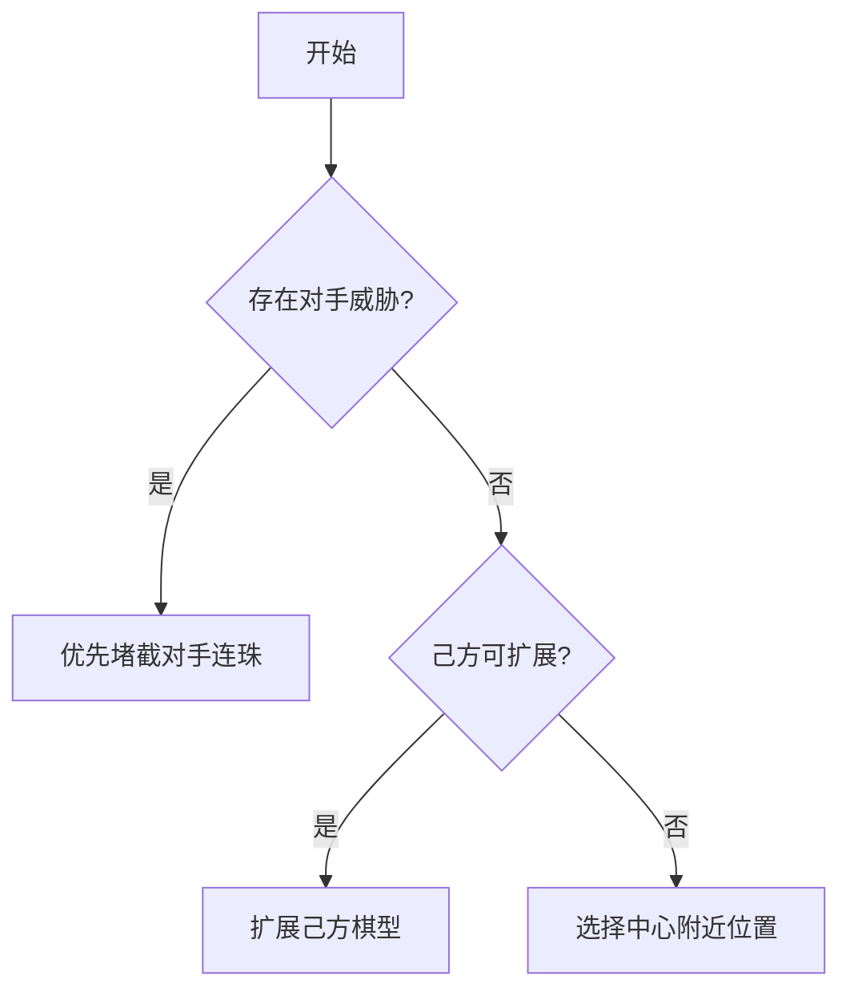

# RL-ChessMaster

A chess AI trained using deep reinforcement learning, featuring adjustable difficulty levels and integration of multiple RL algorithms for comparative analysis.

## 当前实现功能

### 核心功能模块
1. **可视化交互界面**
   - 基于Tkinter实现的GUI棋盘
   - 支持人类玩家与AI对战
   - 提供重新开始对局功能
   - 棋子落点可视化(黑/白棋子区分)

2. **游戏环境引擎**
   - 标准15x15五子棋棋盘
   - 胜负判定逻辑(五连珠检测)
   - 非法落子检测与处理
   - 玩家回合管理(1/-1表示双方)

3. **贪心策略智能体**
   - 三级决策优先级策略
   - 棋型分析与威胁评估
   - 基于曼哈顿距离的中心偏好

4. **棋盘分析工具集**
   - 连珠模式检测(活三、跳三等)
   - 威胁等级评估系统
   - 位置权重计算模型
   - 多维度棋局分析API

5. **测试覆盖**
   - 智能体策略单元测试
   - 环境基础功能测试
   - 棋盘工具函数验证
   - 边缘情况测试套件

## Greedy Agent策略优先级

### 决策逻辑流程图


### 详细策略说明
1. **一级优先级:对手威胁拦截**
   - 检测条件:对手存在>=3连的活棋型
   - 响应策略:在威胁路径端点落子堵截
   - 支持模式:
     * 水平/垂直连珠
     * 正/反对角线连珠
     * 边缘特殊连珠
     * 跳子连珠模式

2. **二级优先级:己方棋型扩展**
   - 激活条件:无紧急拦截需求
   - 扩展策略:
     * 优先延长己方最长连珠
     * 评估潜在连珠价值
     * 选择形成活棋型的位置
     * 平衡发展与防御

3. **三级优先级:中心区域落子**
   - 触发条件:无明确战术目标
   - 选择策略:
     * 计算位置中心权重
     * 曼哈顿距离优先
     * 空位排序选择
     * 防止散点布局

## 典型决策示例
```python
# 模拟棋局片段
board = [
    [0, 0, 0, 0, 0],
    [0, 1, 1, 1, 0],  # 己方三连
    [0,-1,-1,-1, 0],  # 对手三连
    [0, 0, 0, 0, 0]
]

# 决策过程:
1. 检测到对手水平三连威胁
2. 选择堵截位置(1,4)或(1,0)
3. 优先堵截后形成己方四连机会
```

## 项目结构
```
├── agents/              # 智能体实现
│   └── greedy_agent.py  # 贪心策略核心
├── envs/                # 游戏环境
│   ├── base_env.py      # 棋类基础环境
│   └── gomoku_env.py    # 五子棋规则实现
├── utils/               # 工具模块
│   └── board_utils.py   # 棋盘分析工具
├── tests/               # 测试套件
└── main.py              # 主界面程序
