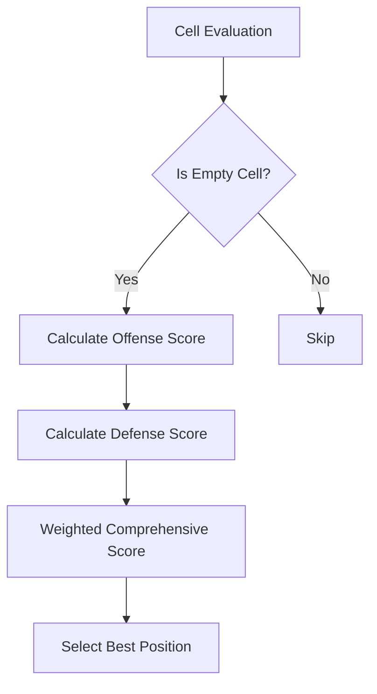

# RL-ChessMaster: Chess AI Agent Project

<h4 align="center">
    <p>
        <b>English</b> |
        <a href="./README_ZH.md">中文</a>
    <p>
</h4>

## Project Overview

RL-ChessMaster is a Gomoku AI agent project based on rule-based and reinforcement learning approaches, aiming to explore different game strategies and intelligent decision-making methods.

## Core Components

### Rule-Based Agent

The rule-based agent's core logic is based on fine-grained board position assessment, primarily involving the following key steps:

#### Position Evaluation Process



#### Scoring Mechanism Details

1. **Offense Score**
   - Analyze continuous chess piece count
   - Identify critical patterns (alive three, alive four, etc.)
   - Consider jump strategies
   - Reward advanced patterns like "double alive three"

2. **Defense Score**
   - Assess opponent's potential threats
   - Calculate possible opponent patterns
   - Reduce opponent's winning probability

3. **Comprehensive Score**
   - Combine offense and defense scores
   - Adjustable weights for balance

#### Key Scoring Factors

- Five in a Row: 100,000 points
- Alive Four: 10,000 points
- Double Alive Three: 5,000 points
- Dead Four: 1,000 points
- Alive Three: 500 points

### Main Features

- Multi-dimensional board evaluation
- Flexible weight configuration
- Center position preference
- Jump strategy support

## Installation and Usage

```bash
git clone https://github.com/your-repo/RL-ChessMaster.git
cd RL-ChessMaster
pip install -r requirements.txt
```

## Contribution Guidelines

1. Fork the project
2. Create a feature branch
3. Commit your code
4. Create a Pull Request

## License

MIT License
