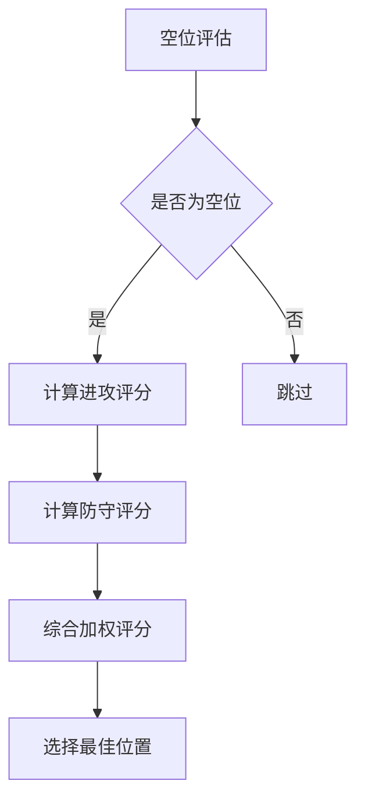

# RL-ChessMaster: 棋类智能体项目

<h4 align="center">
    <p>
        <b>中文</b> |
        <a href="./README.md">English</a>
    <p>
</h4>

## 项目简介

RL-ChessMaster 是一个基于规则和强化学习的五子棋智能体项目,旨在探索不同的五子棋游戏策略和智能决策方法。

## 核心组件

### 规则基础智能体(Rule-Based Agent)

规则基础智能体的核心逻辑基于对棋盘位置的精细评估,主要包括以下关键步骤:

#### 位置评估流程



#### 评分机制详解

1. **进攻评分(Offense Score)**
   - 分析连续棋子数量
   - 识别关键棋型(活三、活四等)
   - 考虑跳子策略
   - 奖励"双活三"等高级棋型

2. **防守评分(Defense Score)**
   - 评估对手潜在威胁
   - 计算对手可能形成的棋型
   - 降低对手获胜可能性

3. **综合评分**
   - 结合进攻和防守评分
   - 可调节权重,平衡进攻与防御

#### 关键评分因子

- 连五:100000分
- 活四:10000分
- 双活三:5000分
- 死四:1000分
- 活三:500分

### 主要特点

- 多维度棋局评估
- 灵活的权重配置
- 考虑位置中心偏好
- 支持跳子策略

## 安装与使用

```bash
git clone https://github.com/your-repo/RL-ChessMaster.git
cd RL-ChessMaster
pip install -r requirements.txt
```

## 贡献指南

1. Fork 项目
2. 创建特性分支
3. 提交代码
4. 创建 Pull Request

## 许可证

MIT License